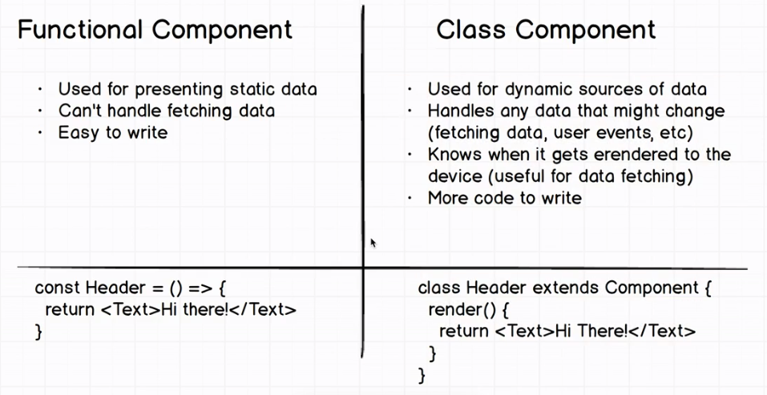

# learning React
ES6, React project setup, and React programming.

### ES6
 - Difference between var, let and const
 - Arrow function and difference between normal function
 - String interpolation
 - Object destructuring
 - Spread operator
 - Array Map() method
 - Modules Export and Import
 
### Reference Link:

 - [Object destructuring](https://dev.to/sarah_chima/object-destructuring-in-es6-3fm###)

### React Setup
 - create-react-app([Reference](https://github.com/facebook/create-react-app))
 - React Boilerplate
 - React Custom setup(Toolchain)
 
### React Setup tools
 - package manager (Yarn or npm)
 - Webpack(bundler)
 - Compiler(Babel)
 - Express(web Application Framework)
 - react-scripts
 
## NPM package
 - NPM(Node Package Manager) is a package manager for Node.js packages.
 ```
 npm init
 ```
 - npm init can be used to set up a new or existing npm package. This comment will creata a package.json file in your directory.
 - This package.json file contains all installed npm packages with versions.
 
 - [www.npmjs.com](https://www.npmjs.com/)
 hosts thousands of free packages to download and use.

## Webpack
 - Webpack is a Javascript module bundler.
 - Webpack bundle front-end assets like HTML, CSS, images, Javascript, etc.
 - [Webpack Reference](https://survivejs.com/webpack/what-is-webpack/)
 


plugins or Loaders  | Use
--------|-------
webpack-node-externals | Ignore node_modules when creating the build for the server
Webpack Dev Middleware | Watches your source files and runs a webpack build anytime you hit save on a file. All changes are handled in memory.
webpack-hot-middleware | HMR executes the changes in the browser without you having to refresh the page manually.


## Babel
- Babel is mainly used to convert ECMAScript code into compatible version of javascript in current and older browser.


[Babel Tool](https://babeljs.io/repl)

## Express
 - Express is javascript web application framework that provides you with a simple API, Web apps and back ends.
 - It parses incoming requests with JSON payloads and is based on body-parser.


Module  | Usage
------- | -------
express.static | serves static assets such as HTML files, images, and so on.
express.json | Parses incoming requests with JSON payloads. 
express.urlencoded | parses incoming requests with URL-encoded payloads.


## react-scripts
- react-scripts is a set of scripts from the create-react-app starter pack.
- react-scripts contains all configruation for running a react project.


### React Programming
 - props
 - state
 - Class Component 
 - Functional Component
 - JSX
 - Updating State
 - Virtual DOM[VDOM](https://www.geeksforgeeks.org/reactjs-virtual-dom/)
 - Component Lifecycle
 
### Reference Image:
## State and Props


## Class Component and Functional Component


 
## Vitual DOM


## React code(JSX, class and functional component)


## React Lifecycle

 

### React Routing
- Navigating one page to another page or another componets.

Package | Description
--------|------------
react-router |  is the core
react-router-dom | web application(wrapped around react-router with extra router elements like BrowserRouter and NavLink)
react-router-native | native development
react-router-redux | integrate react-redux and react-router
react | React is a library for creating user interfaces.
react-DOM | ReactDOM is a library for web apps that lets you manipulate DOM, just like jquery but in react style

Reference: [React Routing](https://programmingwithmosh.com/react/react-router-add-the-power-of-navigation/)


### React API: Axois
- Axois is used for make asynchronous HTTP requests.

Reference: [Axois](http://zetcode.com/javascript/axios/)

### React learning Task

## Task 1:
- Setup React project.
- Download required packages(Axois for API).
- Access the json data from the Link - (User Json data)[https://jsonplaceholder.typicode.com/users]
- Design the page link below images(Image 1 and Image 2)
- Create two componets like user card and user display.
	- User card Component (Image 1)
	- User detail component(Image 2)
- Pass the user details as props to user detail child component from user card compontent.

# Image 1:


# Image 2:


